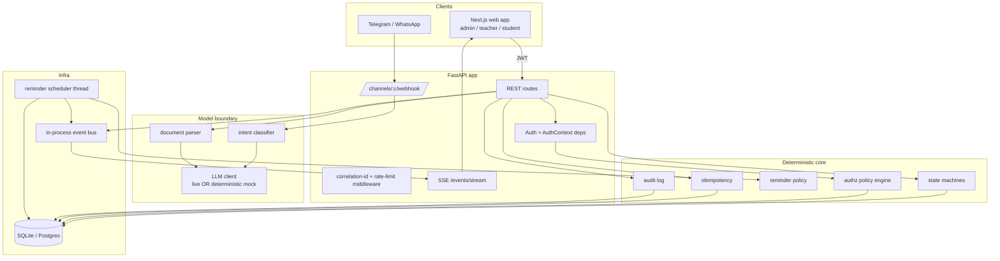

# School Operations Agent Platform

A production-shaped slice of a school operations system: school registration,
role-aware access, document ingestion with human-in-the-loop parsing, an intent
layer over a chat channel, a policy-aware reminder engine, live dashboards, and
an end-to-end audit trail.

Built for the SIM Senior Engineering take-home. The guiding principle throughout
is **the model proposes, deterministic code disposes** — an LLM classifies intent
and extracts fields, but every high-impact action is validated against explicit
business rules and (where it matters) a human approval gate before it touches
domain state.

> **Disclosure (per ground rules):** the backend is FastAPI + SQLAlchemy +
> Pydantic; the frontend is a Next.js App Router scaffold. No undisclosed
> starter repo was used. Framework scaffolding only.

---

## Contents

- [Quick start](#quick-start)
- [Architecture](#architecture)
- [Domain model](#domain-model)
- [Access model](#access-model)
- [Document parsing strategy](#document-parsing-strategy)
- [Intent layer](#intent-layer)
- [State machines](#state-machines)
- [Reminder engine](#reminder-engine)
- [Idempotency & recovery](#idempotency--recovery)
- [Observability & security](#observability--security)
- [Running the demo scenario](#running-the-demo-scenario)
- [Tests & evals](#tests--evals)
- [Known limitations & what I'd do next](#known-limitations--what-id-do-next)
- [ADRs](#adrs)

---

## Quick start

Two processes: a Python backend and a Next.js frontend. SQLite is the default
so a fresh clone runs with **no external services**.

### Backend

```bash
cd backend
python -m venv .venv && source .venv/bin/activate
pip install -r requirements.txt
cp .env.example .env            # works as-is for a local SQLite + mock-LLM demo
python -m scripts.seed          # seeds "Lincoln High" + demo users
uvicorn app.main:app --reload   # http://localhost:8000  (docs at /docs)
```

The seed prints the demo logins (admin@lincoln.test / Password123!, etc.).

### Frontend

```bash
cd frontend
npm install
cp .env.local.example .env.local   # points at http://localhost:8000
npm run dev                        # http://localhost:3000
```

### LLM mode

`LLM_MODE=auto` (default) uses a live model **if** an API key is set, otherwise
it falls back to a **deterministic mock** so the whole system — parsing, intent,
clarifying questions, approval — runs offline and in CI. Set `ANTHROPIC_API_KEY`
(or `OPENAI_API_KEY` with `LLM_PROVIDER=openai`) in `.env` to go live.

### Postgres (production-shaped) — optional

```bash
docker compose --profile postgres up --build   # Postgres + backend
```

The ORM is written DB-portable (UUID + JSON via custom SQLAlchemy types), so the
same models run on SQLite and Postgres unchanged.

---

## Architecture



The shape that matters: **clients never reach the database directly**, the
**model boundary only feeds proposals into deterministic core services**, and
**everything that mutates state writes an audit event under a correlation id**.

---

## Domain model

Entities and the relationships the brief calls for (§2.1):

```mermaid
erDiagram
  SCHOOL ||--o{ USER : has
  SCHOOL ||--o{ CLASS : has
  USER }o--o{ CLASS : "teacher_class_link (M2M)"
  USER ||--o{ ENROLLMENT : "student enrolled"
  CLASS ||--o{ ENROLLMENT : contains
  USER ||--o{ GUARDIAN_STUDENT_LINK : "guardian<->student"
  USER ||--o{ CHAT_IDENTITY : "linked chat"
  SCHOOL ||--o{ INVITE : issues
  SCHOOL ||--o{ DOCUMENT : owns
  CLASS ||--o{ ASSIGNMENT : "targets"
  ASSIGNMENT ||--o{ ASSIGNMENT_TARGET : "per-student"
  ASSIGNMENT ||--o{ SUBMISSION : receives
  SUBMISSION ||--o{ FEEDBACK : has
  ASSIGNMENT_TARGET ||--o{ REMINDER : schedules
  SCHOOL ||--o{ AUDIT_EVENT : records
```

Key modeling decisions:

- **`school_id` on every tenant-scoped row.** Tenancy is the most important
  invariant, so it is denormalized onto child tables. Authorization never needs
  a multi-table join to establish "which school does this belong to," which
  keeps the access-control code small enough for a junior to audit.
- **One `User` table, role-discriminated.** Students and guardians may have a
  `NULL` password because they authenticate via a linked chat identity, not the
  web app.
- **`AssignmentTarget` is materialized per student at publish time.** A
  class-targeted assignment expands into one row per enrolled student so progress
  tracking and reminders have a concrete row to hang state on — the reminder
  query stays a simple scan, not a recomputation.
- **Assignments can target class / group / individual** via `target_type`.

---

## Access model

Five roles, each with an access boundary (§2.2), enforced server-side by a small
pure-Python policy engine (`app/core/authz.py`) that takes an `AuthContext`
(user, school, role, the set of class ids and student ids they're scoped to):

| Role | Boundary | Enforced by |
|---|---|---|
| Admin | Only their school | `require_same_school` on every call |
| Teacher | Only assigned classes/students | `require_teacher_of_class` checks `class_ids` |
| Student | Only own resources | `require_student_self` checks `user_id` |
| Guardian | Only linked, opted-in children | `require_guardian_of_student` checks `student_ids` |
| System/Agent | Through explicit tools + policy | dispatcher + verified `ChatIdentity` gate |

Principles: **tenancy first** (compare school before anything else), **fail
closed** (unknown combinations raise), and **deny is auditable** (every
`AccessDenied` becomes an `ACCESS_DENIED` event so wrong-context attempts appear
in the timeline). Chat-initiated sensitive actions require a **verified** linked
identity; an unlinked chat user is guided to link first.

---

## Document parsing strategy

Flow: **extract → injection-guard → model structured output → validate → review
state → human approval → commit side effects.**

1. **Extract** (`parsers/extract.py`): PDF (pypdf), DOCX (python-docx), CSV
   (normalized), text, and image OCR hook (pytesseract if installed).
2. **Injection defense** (`parsers/injection.py`): document text is wrapped in
   explicit untrusted-content delimiters and the system prompt instructs the
   model to treat it as data, never instructions. A heuristic scanner also flags
   override phrases; a hit forces the document into review even if all fields
   parsed cleanly. The human approval gate is the backstop — an injected
   instruction cannot auto-execute a high-impact action.
3. **Structured output** (`schemas/parsing.py`): the model returns JSON that is
   validated against a Pydantic model. Invalid output is rejected as a model
   failure, never written.
4. **Ambiguity → questions, not guesses** (§3.2): a brief with no due date, or a
   roster with a duplicate row / missing guardian contact, is parked in
   `needs_clarification` with explicit follow-up questions for the reviewer.
5. **Approval** commits the side effect (e.g. roster import creates students +
   enrollments). Stored on the document: original bytes, parsed output,
   confidence, ambiguity notes, and approval state — exactly what §3.2 asks for.

Two document types are fully wired (assignment brief, class roster); policy and
submission documents are stored and injection-scanned.

---

## Intent layer

Incoming chat messages and documents route through `intents/classifier.py`,
which distinguishes all the intents in §3.3 (create/update/cancel assignment,
progress, blocked/help, submission, resubmission, feedback, revision, completion,
parent opt-in/digest, escalation ack, admin config, roster import, policy upload,
and **unknown/unsafe**).

Two safety properties:

- **Injection short-circuits to `UNKNOWN`** before any model call.
- **Role enforcement** (`enforce_role`): even if the classifier returns
  `create_assignment` for a student's message, the role table downgrades it to
  `UNKNOWN`. The model can misclassify; it cannot escalate privilege.

The classifier only *labels* — the deterministic handler in the dispatcher
performs the action. This is the model/tool separation §5 asks for.

---

## State machines

Lifecycles are declared as data (`models/enums.py`) and validated in services:

```
Assignment:  draft → published → active → archived
                 ↘ cancelled  ↘ cancelled  ↘ cancelled

Submission:  submitted → under_review → revision_required → submitted → … → completed
```

Illegal transitions raise `StateTransitionError` (HTTP 409). `completed` and
`cancelled`/`archived` are terminal. Resubmission increments an attempt counter.

---

## Reminder engine

`scheduler/policy.py` is deterministic and model-free, because reminder
decisions must be predictable and auditable. Given a student's progress state,
reminder count, the assignment due date, and the school policy it decides
send / suppress / escalate and records a reason. It:

- respects **quiet hours** (including the midnight-wrap case, e.g. 21:00–07:00);
- treats **silent, blocked, and submitted students differently** (submitted →
  never; blocked → a help-framed follow-up; silent → a standard nudge);
- caps total reminders and escalates to a guardian after N unanswered.

`scheduler/worker.py` runs it on a background thread every tick, and exposes
`POST /api/reminders/run` for the **manual demo trigger** (§4.7).

---

## Idempotency & recovery

- **Webhook retries**: inbound messages are unique on
  `(channel, provider_message_id)`; a redelivered Telegram update is a no-op.
- **Double form submits**: `POST /assignments` honors an `Idempotency-Key`
  header and replays the stored response.
- **Repeated uploads**: documents are deduped on the SHA-256 of their bytes.
- **Reminders**: each `(assignment_target, dedup_key)` is unique, so a sweep
  that runs twice — or resumes after a crash mid-sweep — never double-sends.
- **Scheduler restart**: all reminder state lives in the database, so on boot
  the scheduler simply resumes; nothing is stuck silently (§5 Recovery).

---

## Observability & security

- **Structured JSON logs** with a `correlation_id` propagated via `ContextVar`
  from middleware (HTTP) and the dispatcher (chat), so one
  channel→intent→action→notify flow greps end to end.
- **Audit log** is append-only, PII-screened, and powers the timeline + the live
  SSE ribbon — you can debug a wrong reminder or bad parse without DB inspection.
- **Security**: no secrets in git (`.env.example` + secret-rotation notes),
  upload extension/size validation, JWT expiry + route protection, configurable
  CORS, and a simple in-memory rate limiter. Audit detail is screened for PII so
  dashboards don't leak student/guardian data (§5 Privacy).

---

## Running the demo scenario

The §6 "Minimum Live Scenario" end to end (also encoded as an automated test,
`tests/test_scenario.py::test_minimum_scenario`):

1. Register a school, create Grade 7-A and 8-B, invite a teacher + two students
   + a guardian.
2. Upload `sample_docs/roster.csv` — it flags the duplicate (Sara) and the
   missing contact (Sam); resolve and approve.
3. Upload `sample_docs/assignment_brief.txt` — it's missing a due date, so the
   system asks; approve with a date and create the assignment.
4. One student reports progress, another reports blocked — the teacher dashboard
   updates live.
5. Run the reminder sweep — quiet hours and submitted/blocked/silent are handled
   differently.
6. A student submits, the teacher requests a revision, the student resubmits,
   the teacher completes it.
7. A teacher tries to act on an unassigned class — rejected (403) and audited.
8. The audit timeline replays the whole session by correlation id.

`sample_docs/` contains ready-to-upload files for steps 2–3.

---

## Tests & evals

```bash
cd backend && pytest
```

- `tests/test_authz.py` — pure policy-engine units **and** HTTP-level tests:
  unauthenticated 401, two-school isolation, teacher-on-unassigned-class 403 +
  audited, student-cannot-invite-teacher 403.
- `tests/test_parsing_intent.py` — a labeled **intent eval** with an accuracy
  threshold, injection→unknown, and parsing evals (missing due date flagged,
  duplicate/missing-contact roster flagged, injection in a document forces
  review).
- `tests/test_scenario.py` — state-machine units, idempotency, and the full
  end-to-end minimum scenario through the API.

> Note on the dev environment used to author this: the sandbox had no network to
> install packages, so pure-logic components (state machines, the authz engine,
> the reminder policy, and the mock model heuristics) were verified with
> standalone harnesses, and the full suite is written to run on your machine via
> `requirements.txt`.

---

## Known limitations & what I'd do next

- **Event bus is in-process.** SSE fan-out uses an in-memory bus, so live
  updates are correct on a single instance but not across replicas. Productionize
  by swapping the bus for Redis pub/sub behind the same `publish`/`subscribe`
  interface — the API layer wouldn't change.
- **SSE auth.** `EventSource` can't send an `Authorization` header; for the
  exercise the stream relies on same-origin + the proxy. In production I'd issue
  a short-lived stream token as a query param or move to authenticated
  WebSockets.
- **Parsing is synchronous.** Small documents are parsed inline on upload. Large
  documents should move to a background task with the document sitting in
  `pending_parse` until done.
- **Migrations.** SQLite/demo uses `create_all`; a Postgres deployment should use
  Alembic (dependency included, `migrations/` reserved) instead.
- **Group targets** are modeled (`target_type=group`) but the group membership
  table is left as an extension point; today group resolves like a class.
- **Rate limiter is per-instance in-memory** — fine for the exercise, Redis-backed
  for production.

---

## ADRs

Short architecture decision records live in [`docs/`](docs/):

1. [ADR-0001 — Multi-tenant isolation via denormalized `school_id` + a fail-closed policy engine](docs/ADR-0001-multi-tenant-isolation.md)
2. [ADR-0002 — Lifecycle state machines as data, validated in services](docs/ADR-0002-state-machines-as-data.md)
3. [ADR-0003 — LLM as a proposal engine behind validation and human approval](docs/ADR-0003-llm-as-proposal.md)

See also the [one-page threat model](docs/THREAT-MODEL.md) and the
[implementation note](docs/IMPLEMENTATION-NOTE.md).
